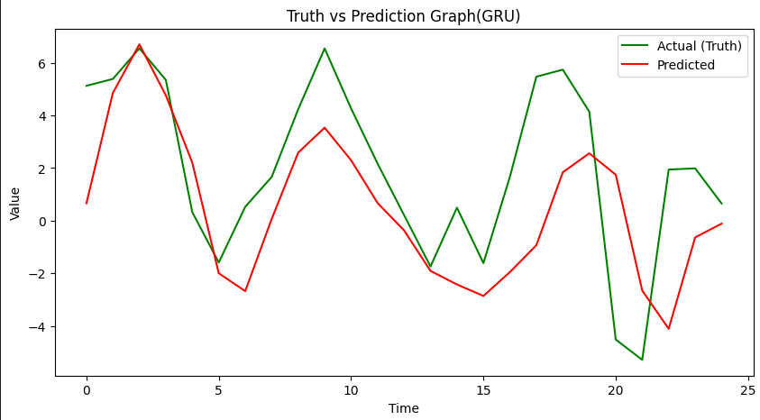
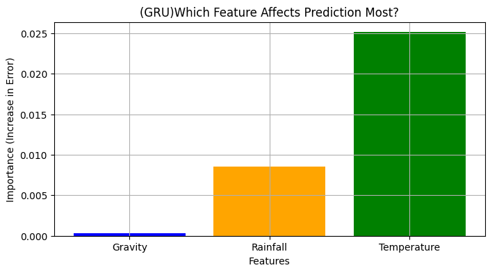
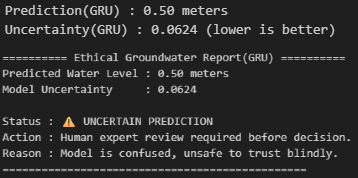

# Germany-Groundwater-AI4EO
Predicting Groundwater depletion in the Rhine River region using Satellite Gravity (GRACE) &amp; Weather Data. Features: LSTM/GRU comparison, Explainable AI (Permutation Feature Importance (PFI)) for climate analysis, and Uncertainty Quantification for ethical AI.


# 🌊 Germany Groundwater Prediction (AI4EO)
**Predicting Groundwater Levels in the Rhine River Basin using Satellite & Climate Data.**


*(Fig: Comparison of Actual Groundwater Levels vs. GRU Model Predictions)*

---

## 🎯 Objective
Groundwater depletion in Germany is a critical issue due to climate change. This project leverages **Satellite Gravity Data (GRACE)** and **Meteorological Data** to predict future groundwater anomalies.
Unlike traditional "Black-box" AI, this project focuses on **Explainability (XAI)** and **Ethical Safety (Uncertainty Estimation)**.

## 🛠️ Tech Stack
* **Data:** Satellite Gravity (GRACE), Rainfall, Temperature.
* **Models:** LSTM vs GRU (Recurrent Neural Networks).
* **Explainability:** SHAP (Shapley Additive exPlanations), Permutation Importance.
* **Safety:** MC Dropout for Uncertainty Quantification.

---

## 📊 Key Results
We compared LSTM and GRU models. **GRU outperformed LSTM** in convergence speed for this dataset.

| Model | MSE Score | RMSE (Meters) | Training Speed |
| :--- | :--- | :--- | :--- |
| **LSTM** | 0.0543 | 0.23 m | Slower |
| **GRU** | **0.0624** | **0.24 m** | **Faster 🚀** |

---

## 🧠 Explainable AI (Why is water decreasing?)
Using SHAP and Feature Importance analysis, we discovered the root cause:



> **Insight:** The model identified **Temperature** (Global Warming) as the most significant factor driving groundwater depletion, more than Rainfall variability. This confirms the impact of rising temperatures on evaporation rates in the region.

---

## 🛡️ Ethical AI & Safety
To prevent blind trust in AI, we implemented an **Uncertainty Warning System**.
If the model is unsure (High Variance), it flags the prediction for human review.



---

## 🚀 How to Run
1. Clone the repo:
   ```bash
   git clone [https://github.com/TeraUsername/Germany-Groundwater-AI4EO.git](https://github.com/TeraUsername/Germany-Groundwater-AI4EO.git)
